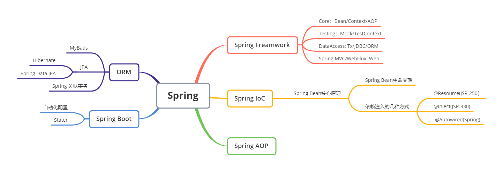
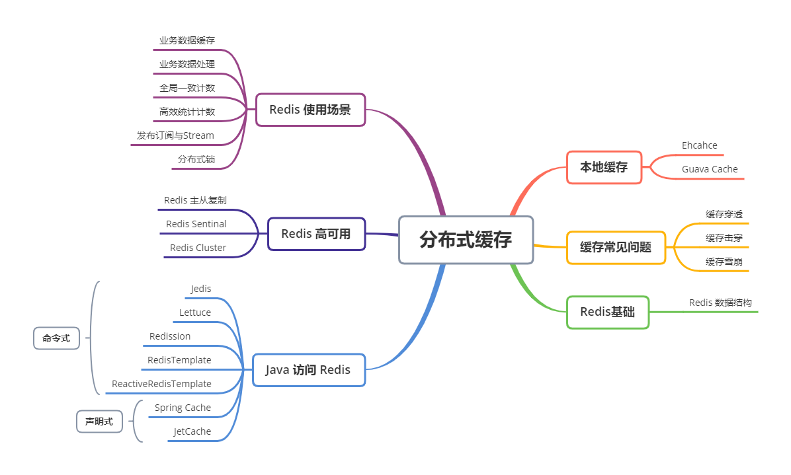

# JVM

Java 虚拟机（Java Virtual Machine，缩写为JVM），以堆栈结构来运作。JVM 屏蔽操作系统的差异，使得 Java 程序只需生成字节码，就可以在多种平台上不加修改的运行。JVM 可以帮助程序员管理内存，内存自动分配和回收极大地提高了开发效率。为保证内存回收的准确，在内存回收的部分阶段需要暂停所有 Java 应用线程，Sun 公司将这件事情称为”Stop The World“（STW）。

## 知识脑图

# NIO

原始的网络编程思路是，服务端使用一个 While 循环，监听端口是否由新的套接字连接，有则处理。这种方式后面的请求会被前面的阻塞，吞吐量低。后来引进多线程或线程池，也就是很经典的 Connection per thread，每一个连接都用一个线程处理，使得吞吐量显著提高。Connection per thread 的缺点也很明显，线程的频繁创建大量的消耗了系统的资源。进一步改进，采用基于事件驱动的设计，当有事件触发时，才会调用处理器进行数据处理。使用Reactor模式，对线程的数量进行控制，一个线程处理大量的事件。Java 中 New IO（NIO）类库是在 Java 1.4 引入，它在标准 Java 代码中提供了高速的面向块的 IO操作。由于之前 I/O 类库是阻塞 I/O，NIO 类库的目标是要弥补了原来同步阻塞 I/O 的不足，让 Java 可以支持非阻塞 IO，所以更多的人喜欢称 NIO 为非阻塞IO（Non-block I/O）。NIO 弥补了原来同步阻塞 I/O 的不足，它在标准 Java 代码中提供了高速的、面向块的 I/O。

## 知识脑图

# 并发编程 

一项任务，引入并行分工的机制往往可以提高任务执行效率，并且能够充分的利用现有资源。但任务一般会有不能被并行执行的部分，这部分占总任务的比例决定了并行机制带来效率提升的上限，也就是说我们不能通过不断地增加并行的数量来使任务的执行效率不断提高。线程是 CPU 调度执行的基本单位，对于单核 CPU 来说多个线程可以通过轮流使用 CPU 时间片的方式并发执行，引入多核技术后，多个线程可以在不同核心上并行执行。多个线程可以通过共享内存进行通信，存在线程安全问题。Java 语言内置了多线程支持，一个 Java 程序实际上是一个 JVM 进程，JVM 进程用一个主线程来执行 main 方法，在 main 方法内部，可以启动多个线程，JVM 还有负责垃圾回收的其他工作线程等。

## 知识脑图

# Spring 和 ORM 等框架

Spring 是一个优秀的 Java 框架，其目的是用于简化企业级应用程序开发。面向对象编程以类和对象作为组织代码的基本单位，在进行面向对象编程时，我们关心如何使这些对象协作来完成所需功能，而且要低耦合、高内聚。Spring 框架能够帮助我们创建对象及管理这些对象之间的依赖关系，简化开发工作。Spring框架的核心特性是 IoC 容器 AOP，引入Spring意味着引入了一种研发协作模式。

## 知识脑图

# MySQL 数据库和 SQL

数据库用来维护业务的数据状态，在整个业务环节中扮演者重要的作用。一般来说，DB/SQL 操作的消耗在一次处理中占比最大，根据 80/20 原则，DB/SQL 优化是系统业务优化的核心，所以学习数据库的原理十分有必要，懂得数据库原理可以让我们在使用数据库时做出的操作更加合理。MySQL 数据库可以分为 Server 层和存储引擎两部分，Server 层提供核心的服务功能，存储引擎则负责数据的数据的存储和读取，其架构模式是插件式的，支持 InnoDB、MyISAM、Memory 等多种存储引擎。现在最常用的存储引擎是 InnoDB，它从 MySQL 5.5.5 版本开始成为了默认存储引擎。

## 知识脑图

# 分库分表

单表的数据量过大，会导致对单表的读写操作性能降低，进而影响了系统的性能和稳定性。数据库主从复制，读写分离只能分担了单个数据库的访问压力，但单个数据库的容量不变，单机性能无法解决。一个好的解决容量的办法对单表进行垂直或水平拆分，降低单表的数据量。对表的拆分会影响到源系统，垂直拆分对业务侵入强，改造过程复杂，容易出现故障；水平拆分会引入一些中间件或中间层使得表的拆分做到透明，对业务影响较小，但会有复杂 SQL 支持问题，数据迁移问题，一致性问题。

## 知识脑图

# RPC和微服务

远程服务将计算机程序的工作范围从单机扩展到网络，从本地延伸至远程，是构建分布式系统的首要基础。而远程服务又不仅仅是为了分布式系统服务的，在网络时代，浏览器、移动设备、桌面应用和服务端的程序，普遍都有跟其他设备交互的需求。RPC 本质上属于面向方法编程，存在如何表述数据，如何传递数据，如何确定方法三个基本问题。

微服务是一种通过多个小型服务组合来构建单个应用的架构风格，这些服务围绕业务能力而非特定的技术标准来构建。各个服务可以采用不同的编程语言，不同的数据存储技术，运行在不同的进程之中。服务采取轻量级的通信机制和自动化的部署机制实现通信与运维。微服务追求的是更加自由的架构风格，摒弃了几乎所有SOA里可以抛弃的约束和规定，提倡以“实践标准”代替“规范标准”。针对某一分布式问题，在微服务中不会有统一的解决方案，而是有各种技术涌现，这也就对架构者提出了更高的要求，因为架构者需要面对更多的技术，做出更多的权衡（trade-off）。

## 知识脑图

# 分布式缓存

广义上来说，为了加速数据处理，让业务更快访问的临时存放冗余数据，都是缓存，狭义上，现在我们一般在分布式系统里把缓存到内存的数据叫做内存缓存。缓存的本质是处理系统各级处理速度的差异，使用空间换时间。缓存也是提高系统性能的有效办法。

## 知识脑图

# 分布式消息队列

消息队列系统进程间或同一个进程不同线程间的通信方式，是一种三点连接系统（生产者，消费者，消息 Server）。一般来讲，一个消息队列可以实现异步的消息通信 ，可以解耦参与各方，可以在请求量很大的时候进行缓冲，某些情况下能保障消息的可靠性，甚至顺序，即作为一种通信方式，消息队列的优势在于异步通信，系统解耦，削峰平谷，可靠通信。

